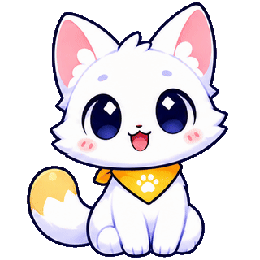

[EN](./README.md) · [ES](./README.es.md) · [ZH](./README.zh-CN.md) · [KO](./README.ko.md) · [JA](./README.ja.md) · [NL](./README.nl.md) · [AR](./README.ar.md) · [VI](./README.vi.md) · [RU](./README.ru.md) · [FR](./README.fr.md) · [HI](./README.hi.md) · [PT-BR](./README.pt-BR.md) · [DE](./README.de.md) · [IT](./README.it.md) · [ID](./README.id.md) · [TR](./README.tr.md) · [PL](./README.pl.md) · [BN](./README.bn.md)

# आइए वेब को और जीवंत बनाएँ ✨

Peeklings छोटे एनिमेटेड किरदार हैं जो किसी वेबसाइट पर चुपचाप और खेल-खेल में शामिल हो सकते हैं, बिना किसी रुकावट के। उनसे मिलने आइए, अपना कोई किरदार सोचिए या आगे बनने वाली चीज़ों में हमारा साथ दीजिए।

## Peekling क्या है?

Peekling एक छोटा एनिमेटेड साथी है, जिसका अपना रूप, व्यक्तित्व और आसपास के पेज पर प्रतिक्रिया देने का तरीका होता है। यह किसी वेबसाइट के साथ रहता है और पेज को उसका मूल स्वरूप बनाए रखने देते हुए उसमें थोड़ी जान डालता है।

इन किरदारों के पीछे Peekling एक ओपन-सोर्स ब्राउज़र रनटाइम है, जिसे केवल डेटा से बने छोटे एनिमेटेड किरदारों के लिए तैयार किया गया है। यह किसी बैकएंड को टेलीमेट्री या पेज का डेटा भेजे बिना उन्हें चलने और प्रतिक्रिया देने में मदद करता है।

## यहाँ आपका स्वागत है

चाहे आप किरदारों से मिलने, कुछ नया सीखने, चित्र बनाने, लिखने, एनिमेशन या कोड बनाने, सिखाने, किसी कंपनी के लिए कुछ तैयार करने या बस यह देखने आए हों कि यहाँ क्या आकार ले रहा है, हमें खुशी है कि आप हम तक पहुँचे।

विद्यार्थी और पहली बार कुछ बनाने वाले लोग प्रयोग कर सकते हैं। कलाकार और लेखक नए व्यक्तित्वों की कल्पना कर सकते हैं। डेवलपर इंटरैक्शन में जान डाल सकते हैं। कंपनियाँ डिजिटल जगहों को अधिक मानवीय बनाने में मदद कर सकती हैं। जिन लोगों को बस अपने आसपास एक छोटा साथी अच्छा लगता है, वे भी इस तस्वीर का उतना ही अहम हिस्सा हैं।

आप यहाँ किसी भी वजह से आए हों, शुरुआत के लिए जिज्ञासा ही काफी है।

## हमारे साथ मिलकर बनाएँ

आपको कोड या पूरी तरह तैयार विचार लेकर आने की ज़रूरत नहीं है। आसपास देखिए, सवाल पूछिए, प्रतिक्रिया साझा कीजिए, किसी किरदार की कल्पना कीजिए या हमें बताइए कि Peekling कहाँ अपनापन महसूस कर सकता है। अगर आपको कुछ ऐसा दिखे जिसे बेहतर बनाया जा सकता है, तो issue खोलें या किसी स्पष्ट हिस्से पर केंद्रित योगदान भेजें। कला, कहानियाँ, दस्तावेज़ और कोड, सभी मदद करने के तरीके हैं।

## Peekling रिपॉज़िटरी

| रिपॉज़िटरी | विवरण |
| --- | --- |
| [peekling-characters](https://github.com/peekling/peekling-characters) | आधिकारिक किरदार पैक का घर। |

## Peek से मिलिए

  

Peek पहला Peekling है। जिज्ञासु और खुशमिज़ाज Peek पॉइंटर का पीछा करता है और छोटी सफलताओं का जश्न मनाता है।

Peekling एक छोटा किरदार है जो किसी वेबसाइट के आसपास चुपचाप और खेल-खेल में रह सकता है, बिना किसी रुकावट के।

आप अपना Peekling बना सकते हैं और उसे अपनी वेबसाइट में जोड़ सकते हैं। शुरुआत करने के लिए [इस गाइड का पालन करें](https://github.com/peekling/peekling-characters#make-a-character)।

## साथ मिलकर आगे बढ़ना

Peekling एक बार में एक सार्वजनिक हिस्सा जोड़ते हुए बढ़ रहा है। जैसे-जैसे और हिस्से उपलब्ध होंगे, हम चाहते हैं कि यह सफ़र स्वाभाविक लगे: किसी किरदार से मिलें, उसे जानें, आज़माएँ, वेबसाइट में जोड़ें, उसे अपना बनाएँ और जो सीखें उसे समुदाय के साथ साझा करें।

इस सफ़र के कुछ हिस्से अभी आगे आने बाकी हैं। हम उन्हें तभी पेश करेंगे जब वे तैयार होंगे, और हर सार्वजनिक हिस्सा अगले व्यक्ति के लिए जुड़ना आसान बनाएगा।

Peekling ओपन सोर्स है और Apache 2.0 लाइसेंस के तहत उपलब्ध है।

<!--
भविष्य के सार्वजनिक इकोसिस्टम के लिए सामग्री
जब तक हर गंतव्य सार्वजनिक दर्शकों के लिए तैयार न हो जाए, इस खंड को टिप्पणी के रूप में ही रखें।
टिप्पणी हटाने से पहले वेबसाइट और प्लेग्राउंड के अस्थायी लक्ष्यों को बदलें।

## एक आनंदपूर्ण इकोसिस्टम आकार ले रहा है

Peekling अलग-अलग किरदार पैक से आगे बढ़कर एक ऐसी स्वागतपूर्ण जगह बन रहा है, जहाँ अभिव्यक्तिपूर्ण वेब साथियों को खोजा, बनाया और साझा किया जा सके।

- **[Peekling वेबसाइट](#replace-with-website-url)** परियोजना, इसके किरदारों और वेब में थोड़ी और जान डालने के पीछे के विचारों से परिचित कराएगी।
- **[एक इंटरैक्टिव प्लेग्राउंड](#replace-with-playground-url)** किरदारों से मिलना, उनके व्यक्तित्वों को समझना और किसी किरदार को परियोजना में जोड़ने से पहले प्रयोग करना आसान बनाएगा।
- **[और अधिक ओपन-सोर्स बिल्डिंग ब्लॉक](https://github.com/peekling)** डेवलपर और रचनाकारों को Peekling इकोसिस्टम को अपनी ज़रूरत के अनुसार बदलने, आगे बढ़ाने और उसमें योगदान देने के नए तरीके देंगे।

इन अनुभवों की योजना बन चुकी है, लेकिन ये अभी सार्वजनिक रूप से उपलब्ध नहीं हैं। तैयार होने पर आप इन्हें इसी संगठन में पाएँगे।
-->

